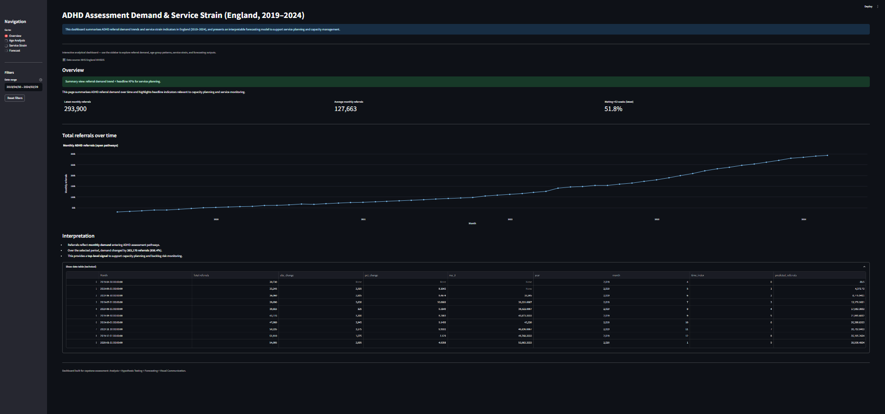
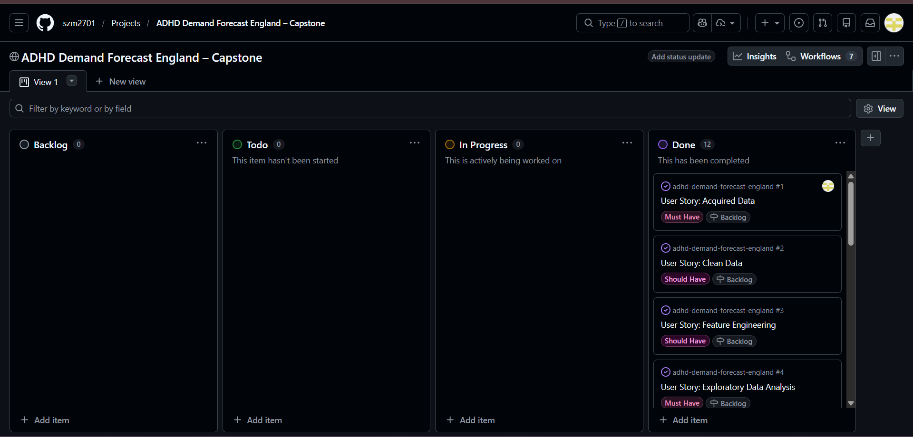
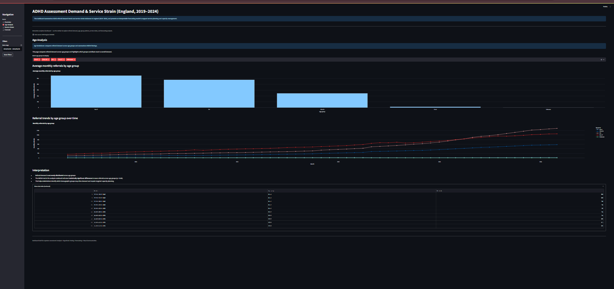
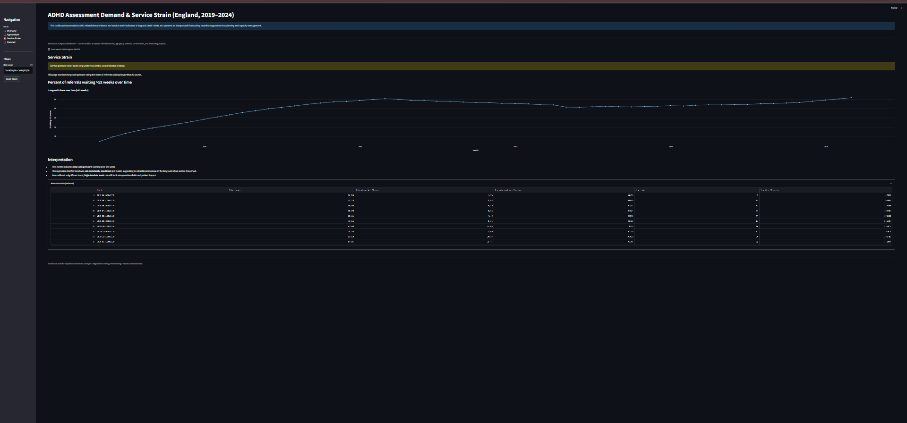
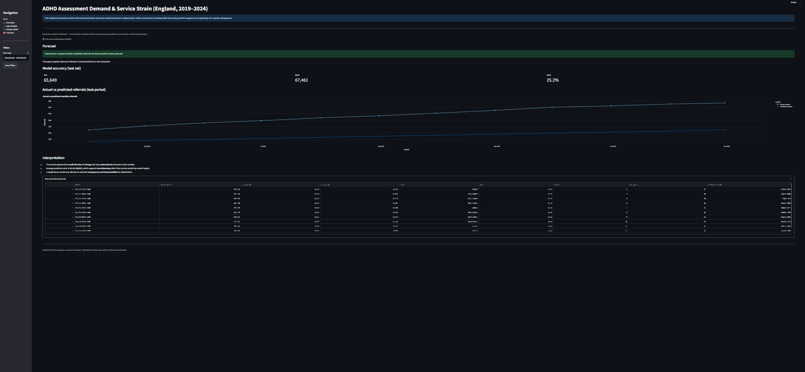

# 


# Analysis and Forecasting of ADHD Assessment Demand and Service Strain in England (2019–2024)



This project applies statistical analysis and forecasting techniques to NHS ADHD referral data to identify demand trends and visualise service pressures through an interactive Streamlit dashboard.


## Table of Contents

- [Project Overview](#project-overview)
- [Objectives](#objectives)
- [Project Workflow](#project-workflow)
- [Dataset](#dataset)
- [Business Requirements](#business-requirements)
- [Hypothesis Validation](#hypothesis-validation)
- [Development Roadmap](#development-roadmap)
- [Tools & Technologies](#tools--technologies)
- [Use of Generative Artificial Intelligence (GenAI)](#use-of-generative-artificial-intelligence-genai)
- [How to Run the Project](#how-to-run-the-project)
- [Dashboard](#dashboard)
- [Ethical Considerations](#ethical-considerations)
- [Limitations](#limitations)
- [Future Improvements](#future-improvements)
- [Learning Journey](#learning-journey)
- [Project Structure](#project-structure)
- [Key Project Outputs](#key-project-outputs)
- [Author](#author)
- [References](#references)


## Project Overview

This project analyses national ADHD referral data from NHS England to examine trends in assessment demand, evaluate indicators of service strain, and develop an interpretable forecasting model for future referral volumes.

Statistical hypothesis testing and regression modelling are used to determine whether referral demand has increased significantly over time, whether referral levels differ across age groups, and whether long-wait referral proportions indicate increasing pressure on services.

An interactive Streamlit dashboard was developed to communicate the analytical findings through stakeholder-focused visualisations.


## Objectives

The primary objective of this project is to analyse ADHD referral demand trends in England and evaluate indicators of service strain within NHS assessment pathways.

Specific objectives include:

- Determining whether ADHD referral demand has increased significantly over time.
- Identifying differences in referral patterns across age groups.
- Evaluating long-wait referral proportions as an indicator of service strain.
- Developing a forecasting model to estimate future referral demand.
- Communicating insights through an interactive Streamlit dashboard.


## Project Workflow

The project follows a structured analytics pipeline in which raw NHS data is cleaned and transformed into structured analytical datasets, used for statistical analysis and forecasting, and then communicated through an interactive Streamlit dashboard.

The project follows a structured analytics pipeline:

1. **Data Collection**
   - NHS ADHD referral statistics were obtained from NHS England MHSDS reports.

2. **Data Preparation**
   - Raw datasets were cleaned and structured into time-series datasets.

3. **Statistical Analysis**
   - Regression and ANOVA tests were used to evaluate referral trends and demographic differences.

4. **Forecast Modelling**
   - A linear regression model was used to forecast future referral demand.

5. **Dashboard Development**
   - Results were communicated through an interactive Streamlit dashboard.


## Dataset

The dataset used in this project is derived from **NHS England Mental Health Services Monthly Statistics (MHSDS)**.

It contains national-level indicators relating to ADHD referrals and waiting times across England.

Key variables analysed include:

- Total open ADHD referrals
- Age-group referral counts
- Referrals waiting longer than 52 weeks
- Monthly reporting periods

Raw data is stored in: data/raw/MHSDS_historic.csv

Processed datasets used for modelling and dashboard visualisation are stored in: data/processed/


## Business Requirements

This project addresses the following analytical questions:

1. Has ADHD referral demand increased significantly over time in England between 2019 and 2024?
2. Do mean referral counts differ significantly across age groups?
3. Has the proportion of referrals waiting longer than 52 weeks increased over time?
4. Can future ADHD referral demand be predicted with acceptable accuracy using supervised machine learning?


## Hypothesis Validation

Three statistical hypotheses were tested.

### H1 – Growth Trend in ADHD Referrals

**Null hypothesis (H0)**  
There is no statistically significant relationship between reporting month and open ADHD referral counts.

**Alternative hypothesis (H1)**  
There is a statistically significant positive relationship between reporting month and open ADHD referral counts.

Test used: Linear regression

Result: **Reject H0 (p < 0.001)**


### H2 – Age Group Differences

**Null hypothesis (H0)**  
There is no statistically significant difference in mean open ADHD referral counts across age groups.

**Alternative hypothesis (H2)**  
There is a statistically significant difference in mean open ADHD referral counts across age groups.

Test used: One-way ANOVA

Result: **Reject H0 (p < 0.05)**


### H3 – Long Wait Service Strain

**Null hypothesis (H0)**  
There is no statistically significant relationship between reporting month and the proportion of ADHD referrals waiting more than 52 weeks.

**Alternative hypothesis (H3)**  
There is a statistically significant relationship between reporting month and the long-wait referral proportion.

Test used: Linear regression

Result: **Reject H0 (p < 0.001)**


## Development Roadmap

Project development was organised using a GitHub Project Board following a Kanban-style workflow. Tasks were structured into stages including **To Do**, **In Progress**, and **Done**, allowing progress to be tracked throughout the project lifecycle.

The board was used to manage key project tasks including:

- Data preparation and cleaning
- Statistical analysis and hypothesis testing
- Forecast model development
- Dashboard implementation
- Documentation and reporting

### Project Board



You can also view the live project board here:

[GitHub Project Board](https://github.com/users/szm2701/projects/2/views/1)


## Tools & Technologies

The project was implemented using the following tools and technologies:

- Data cleaning and preprocessing
- Time-series structuring
- Descriptive statistical analysis
- Linear regression trend testing
- One-way ANOVA hypothesis testing
- Forecast modelling using linear regression
- Model evaluation using MAE, RMSE and MAPE

Python libraries used include:

- pandas
- numpy
- scipy
- statsmodels
- matplotlib
- plotly
- streamlit

Development environment: VS Code
Version control: Git & GitHub


## Use of Generative Artificial Intelligence (GenAI) 

GenAI (Microsoft Copilot) was used to support the workflow:

- Code support: assisting with debugging. 
- Data storytelling and communication: refining text such as the project title, motivation, and objectives. Helping to write interpretations of each chart for a non-technical audience. 


## How to Run the Project

1. Clone the repository:

```
git clone <repo-url>
```

2. Navigate to the project folder.

3. Install dependencies:

```
pip install -r requirements.txt
```

4. Run the Streamlit dashboard:

```
streamlit run app.py
```

The analysis notebook can be found in: jupyter_notebooks/adhd_demand_analysis_and_forecasting.ipynb


## Dashboard

An interactive dashboard was developed using **Streamlit** to present the analytical findings.

The dashboard includes four analytical views:

1. **Overview**
   - National referral demand trends
   - Key performance indicators

2. **Age Analysis**
   - Referral comparisons across age groups
   - Statistical insight from ANOVA testing

3. **Service Strain**
   - Long-wait referral trends (>52 weeks)

4. **Forecast**
   - Predicted vs actual referrals
   - Model accuracy metrics

To run the dashboard locally: 

streamlit run app.py


Example dashboard views:









## Ethical Considerations

The project uses publicly available aggregated NHS statistics.  
No personally identifiable data is included.

Analysis was conducted responsibly and results are interpreted cautiously to avoid overgeneralisation.


## Limitations

Several limitations should be considered when interpreting the results:

- The dataset contains aggregated national-level statistics, preventing regional analysis.
- Referral data reflects service activity rather than underlying ADHD prevalence.
- The forecasting model assumes continuation of historical trends.
- External factors such as policy changes or service capacity expansions may influence future referral demand.


## Future Improvements

Potential improvements include:

- Incorporating regional-level referral data
- Testing more advanced forecasting models
- Automating data updates for the dashboard
- Extending the dashboard with additional service indicators


## Learning Journey

This project provided an opportunity to apply the full data analytics workflow to a real-world healthcare dataset, from raw data preparation through statistical analysis, modelling, and dashboard development. One of the initial challenges involved working with NHS management information data that contained suppressed values and multiple indicator codes. Understanding the structure of the dataset and identifying the correct indicators required careful exploration and validation before the analytical workflow could be established.

Another challenge involved structuring the dataset for time-series analysis and ensuring that the statistical models used were appropriate for the research questions. Creating structured monthly datasets, engineering time-index variables, and preparing data for regression modelling required careful data preparation and verification to ensure the analysis was methodologically sound.

During the analysis process, an important learning moment occurred when revisiting the regression results for the service strain indicator (the proportion of referrals waiting longer than 52 weeks). Initially, the results were interpreted as not statistically significant, but further validation of the modelling outputs revealed that the regression actually indicated a statistically significant positive trend. Identifying and correcting this interpretation required careful review of the regression output and highlighted the importance of validating statistical results before drawing conclusions. This experience reinforced the value of critically reviewing analytical outputs and ensuring consistency between statistical results, written interpretations, and visualisations.

The development of the Streamlit dashboard also introduced new technical considerations, particularly around structuring the application, optimising performance using cached data loading, and presenting statistical results in a way that remains accessible to non-technical stakeholders. Designing visualisations that clearly communicated the analytical findings while maintaining usability required iterative adjustments to the dashboard layout and content.

Overall, the project strengthened practical skills in data cleaning, statistical analysis, hypothesis testing, model evaluation, and data communication. Building an end-to-end analytics pipeline—from raw dataset to interactive dashboard—provided valuable experience in translating complex data into clear, actionable insights. These experiences help prepare for future work in data analytics, where both technical rigour and effective communication are essential.


## Project Structure

```
adhd-demand-forecast-england/
│
├── data
│   ├── raw
│   │   └── MHSDS_historic.csv
│   └── processed
│       ├── referrals_timeseries.csv
│       ├── age_group_referrals.csv
│       ├── service_strain.csv
│       └── forecast_results.csv
│
├── images
│   ├── dashboard_overview.png
│   ├── dashboard_age_analysis.png
│   ├── dashboard_service_strain.png
│   ├── dashboard_forecast.png
│   └── dashboard_wireframe.drawio.png
│
├── jupyter_notebooks
│   └── adhd_demand_analysis_and_forecasting.ipynb
│
├── app.py
├── requirements.txt
└── README.md
```


## Key Project Outputs

The main outputs of the project include:

- **Analysis notebook**  
  `jupyter_notebooks/adhd_demand_analysis_and_forecasting.ipynb`

- **Processed datasets used for modelling**  
  `data/processed/`

- **Interactive Streamlit dashboard**  
  `app.py`

- **Dashboard screenshots used in documentation**  
  `images/`


## Author

Shazia  

Data Analytics Capstone Project 2 - March 2026 


## References

NHS Digital (2025) *Mental Health Services Monthly Statistics – ADHD Waiting Times and Referrals.*  
Available at: https://digital.nhs.uk/data-and-information/publications/statistical/mental-health-services-monthly-statistics  
(Accessed: 25 February 2026).

NHS England (2024) *ADHD services and policy updates.*  
Available at: https://www.england.nhs.uk/mental-health/adhd/  
(Accessed: 25 February 2026).

NICE (2018) *Attention deficit hyperactivity disorder: diagnosis and management (NG87).*  
Available at: https://www.nice.org.uk/guidance/ng87  
(Accessed: 25 February 2026).

UK Parliament House of Commons Library (2026) *FAQ: ADHD statistics (England).*  
Available at: https://commonslibrary.parliament.uk/research-briefings/cbp-10551/  
(Accessed: 4 March 2026).

